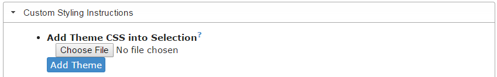
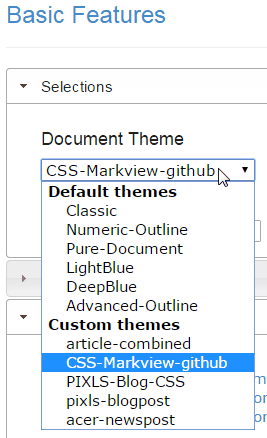
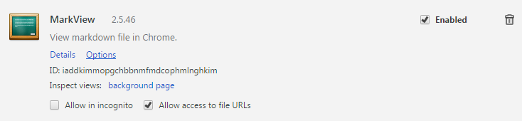

# markview-css
CSS files to use with MarkView for formatting markdown files like specific sites.

[MarkView][] is a [Chrome extension][] to render [markdown][] files in a browser according to pre-defined styles.

[MarkView]: http://www.baiyunconsulting.com/portfolio-markview.html
[Chrome extension]: https://chrome.google.com/webstore/detail/markview/iaddkimmopgchbbnmfmdcophmlnghkim
[markdown]: https://daringfireball.net/projects/markdown/

The extension already comes with some pre-defined styles but things get way more interesting when you start supplying your own css styles.  This lets you emulate the styling for getting a live preview of the markdown rendering.

I have included some common (_to me_) styles here.

## Usage

1. Clone this repository.
2. Open MarkView Options.
3. Under "_Custom Styling Instructions_", **Add Theme CSS into Selection**, select "Choose File" and load one of the .css files from this repo.
4. Then press the "Add Theme" button.

    

5. Repeat for each css style you want to use.

### Select Style
To select a theme to use, from MarkView Options &rarr; Document Theme:

### Allow File Access
It's important to turn **On** _Allow access to file URLs_ for the extension.
Under Chrome "_Manage Extensions_", find the **MarkView** entry and allow this access:

### Loading a Markdown file
Simply drag and drop a markdown file into Chrome and MarkView will automatically render the markdown for you.  The extension will also automatically update the page every time the markdown file is saved.
